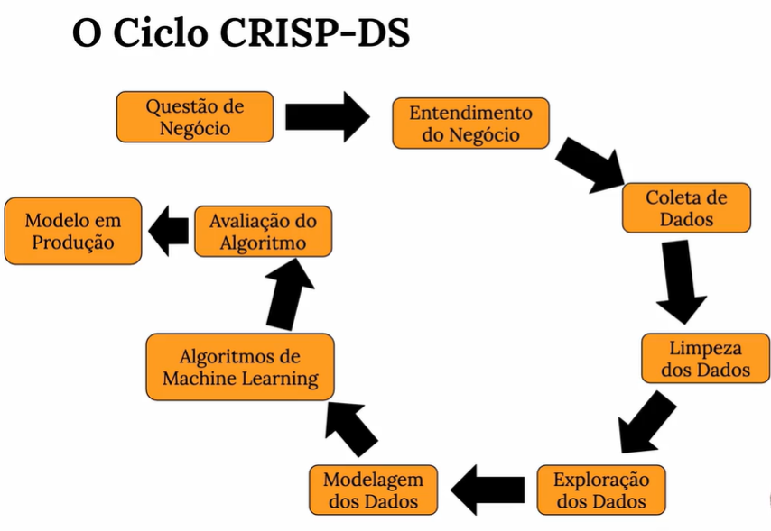
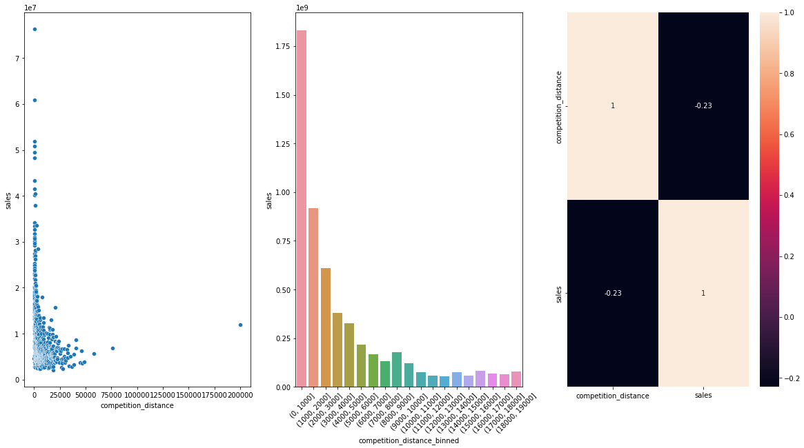
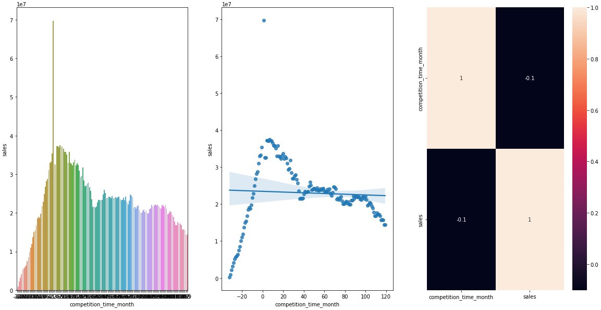
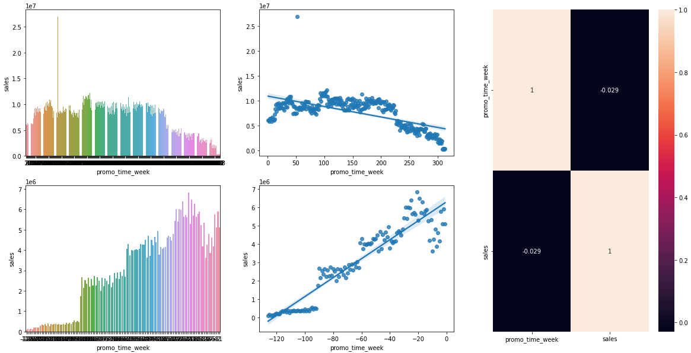
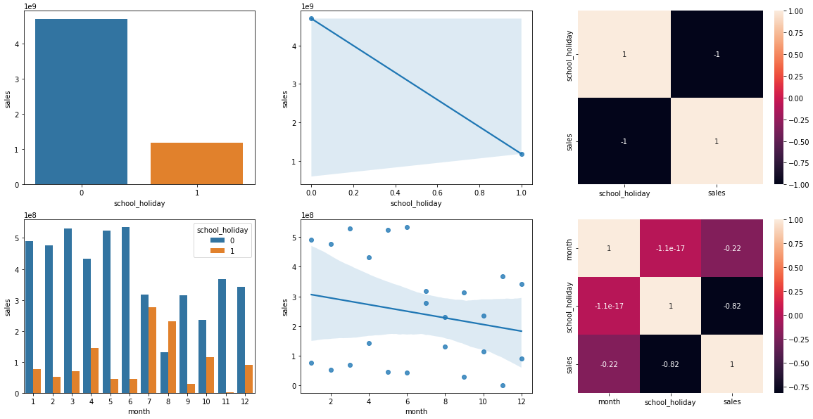
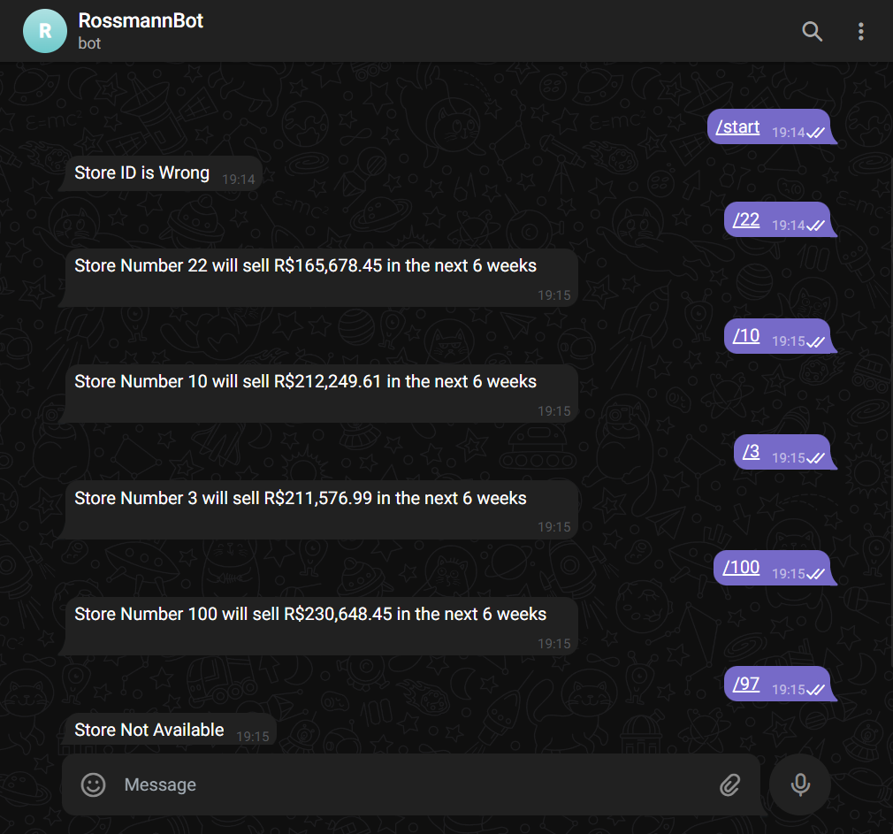

<h1 align="center">Drogarias Rossmann</h1>

- [0. Ferramentas Utilizadas](#0-ferramentas-utilizadas)
- [1. Problemas de Negócio](#1-problemas-de-negócio)
    - [1.1. Contextualização](#11-contextualização)
    - [1.2. Necessidade](#12_necessidade)
    - [1.3. Considerações](#13-considerações)
- [2. Estratégia de Solução](#2-estratégia-de-solução)
- [3. Exploratory Data Analysis (Algumas Hipóteses)](#3-exploratory-data-analysis-(algumas-hipóteses))
- [4. Resultado](#4-resultado)
- [5. Próximos Passos](#5-próximos-passos)
- [6. Agradecimento](#5-agradecimento)

<h2>0. Ferramentas Utilizadas</h2>

  
  
  
  
  
  
  
  
  

<h2>1. Problemas de Negócio</h2>
<ul>
    <h3>1.1. Contextualização</h3>
    
A Rossmann é uma das maiores cadeias de drogarias da Europa, com cerca de 56.200 funcionários e mais de 4.000 lojas em diversos países. É uma empresa com um grande sortimento de produtos que são oferecidos aos seus clientes, incluindo produtos próprios. A companhia está em grande expansão e num ritmo elevado, com grandes investimentos.

    <h3>1.2. Necessidade</h3>
    
O projeto foi desenvolvido a partir da necessidade do CFO da empresa em destinar orçamento para reforma das lojas da rede. Visto que é necessário saber quanto as lojas irão vender para dimensionar o investimento da reforma, o produto de dados de previsão de vendas foi o que mais se destacou para sanar a dor do CFO. Diante dessa situação o diretor pediu ao time de dados uma solução que venha fazer essa previsão de forma mais precisa, rápida e prática, podendo acessar de qualquer lugar com um simples smartphone

    <h3>1.3. Considerações</h3>
    <ol>
        <li>Os dias em que as lojas estão fechadas serão removidos da análise.
        <li>Apenas lojas abertas e que possuam vendas serão consideradas.</li>
        <li>Para lojas que não possuem competidor próximo, será considerado uma
        distância muito maior do que a máxima presente nos dados analisados.</li>
    </ol>
</ul>

<h2>2. Estratégia de Solução</h2>

Criar um modelo de Machine Learning criado através do método CRSIP-DS. Entendendo o problema de negócio, coletando e limpando os dados, criando um dataset único, pensar em hipóteses de negócio para novas features, conferir as hipóteses na análise exploratória de dados (EDA), modelando os dados para a implementação nos algoritmos, implementando-os, avaliando a performance dos mesmos e botando o modelo em produção.

    

<h2>3. Exploratory Data Analysis (Algumas Hipóteses)</h2>
<Ul>
    <li>Lojas com competidores mais próximos deveriam vender menos. <B>(Falso)</b></li>
      
    <li>Lojas com competidores à mais tempo deveriam vender mais. <B>(Falso)</b></li>
      
    <li>Lojas com promoções ativas por mais tempo deveriam vender mais. <B>(Falso)</b></li>
      
    <li>Lojas deveriam vender menos durante os feriados escolares. <B>(Verdadeiro)</b></li>
    
</Ul>

<h2>4. Resultado</h2>

Na primeira tabela conseguimos ver resultado da predição com o seu melhor e pior cenário, na segunda temos as lojas nas quais o algoritmo desempenhou melhor e na terceira temos as lojas nas quais o algoritmo desempenhou pior utilizando como parâmetro o MAE (Erro Absoluto Médio) e o MAPE (Erro Percentual Médio Absoluto)

<h3><b>Resultado Geral</b></h3>

|Cenários       |Valores         |
|---------------|----------------| 
|Predição       |R$285,982,336.00|
|Pior Cenário   |R$285,122,909.38|
|Melhor Cenário |R$286,841,799.87|

<h3><b>Melhores Resultados</b></h3>

|store	|predictions	|worst_scenario	|best_scenario	|MAE	        |MAPE    |
|-------|---------------|---------------|---------------|---------------|--------|
|1088	|372539.84375	|371947.523134	|373132.164366	|592.320616	    |0.055637|
|1058	|316469.43750	|315959.099279	|316979.775721	|510.338221	    |0.057786|
|666    |315574.09375	|315054.641575	|316093.545925	|519.452175	    |0.058623|
|599    |277802.21875	|277375.754131	|278228.683369	|426.464619	    |0.059230|
|322    |278589.28125	|278135.109296	|279043.453204	|454.171954	    |0.060114|

<h3><b>Piores Resultados</b></h3>

|store	|predictions	|worst_scenario	|best_scenario	|MAE	        |MAPE    |
|-------|---------------|---------------|---------------|---------------|--------|
|292	|107615.710938	|104215.942100	|111015.479775	|3399.768837	|0.602434|
|909	|218553.062500	|210585.819187	|226520.305813	|7967.243313	|0.520197|
|170	|210332.781250	|208754.922376	|211910.640124	|1577.858874	|0.388893|
|902	|202310.546875	|200840.207863	|203780.885887	|1470.339012	|0.366374|
|876	|196113.046875	|192048.999575	|200177.094175	|4064.047300	|0.328779|

<h3><b>Modelo Publicado e Funcionando pelo Telegram</b></h3>

<h2>5. Próximos Passos</h2>
<ul>
    <li>As lojas que têm o MAPE muito alto podem ser criado modelos específicos para elas, como colocar variáveis. O CFO pode determinar uma melhor predição dessas lojas e assim voltando para o CRISP ou podendo descartar essas lojas.</li>
</ul>

<h2>6. Agradecimento</h2>

<b>Muito Obrigado por ter visto meu projeto</b>

Caso queira ver mais projetos meus ou entrar em contato comigo:

<a href="https://rafafaelfilho.github.io/portfolio_projetos/">Outros Projetos</a> 
<a href="https://github.com/RafafaelFilho/portfolio_projetos">Portfólio</a> 
<a href="https://www.linkedin.com/in/rafael-filho/">LinkedIn</a>
